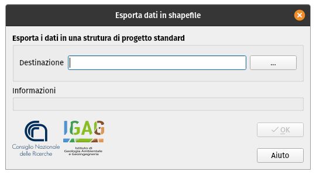

.. _esportazione:

Esportazione del progetto
-------------------------

.. warning:: Lo strumento di esportazione non produce il database in formato Microsoft Access `CLE_db.mdb`,
  come richiesto dagli attuali standard CLE versione 3.1, ma un equivalente database SQlite.

  Il database SQLite esportato contiene semplici tabelle alfanumeriche, i cui dati possono essere esportati
  manualmente, ad esempio in formato `csv`, e quindi importati all'interno del database Access.

La struttura di archiviazione generata dal plugin MzSTools non corrisponde esattamente a quella prevista dagli Standard CLE, in quanto è ottimizzata per l’utilizzo con QGIS. 

La generazione di una struttura conforme agli Standard deve quindi essere considerata come fase finale del flusso di lavoro e può essere eseguita tramite l'apposito strumento di esportazione |ico3| presente sulla toolbar.

La finestra di dialogo dello strumento richiede semplicemente di selezionare una cartella  in cui effettuare l’esportazione. Le principali operazioni effettuate dallo strumento consistono in:

* esportazione dei dati georeferenziati in una serie di *shapefile* e dei dati tabellari associati in semplici tabelle contenute in un database “CLE_db.sqlite”;
* copia dei file e documenti allegati presenti nella cartella “allegati”.   

Al termine delle operazioni, il tool genera un **report testuale**, contenente l’esito dell’esportazione del progetto, all’interno della cartella di progetto ``/allegati/log``. Il nome del report sarà caratterizzato dalla data e dall’ora di esecuzione del tool, e dalla la dicitura “export_log” (ad esempio ``2018-06-13_09-06-23_export_log.txt``).