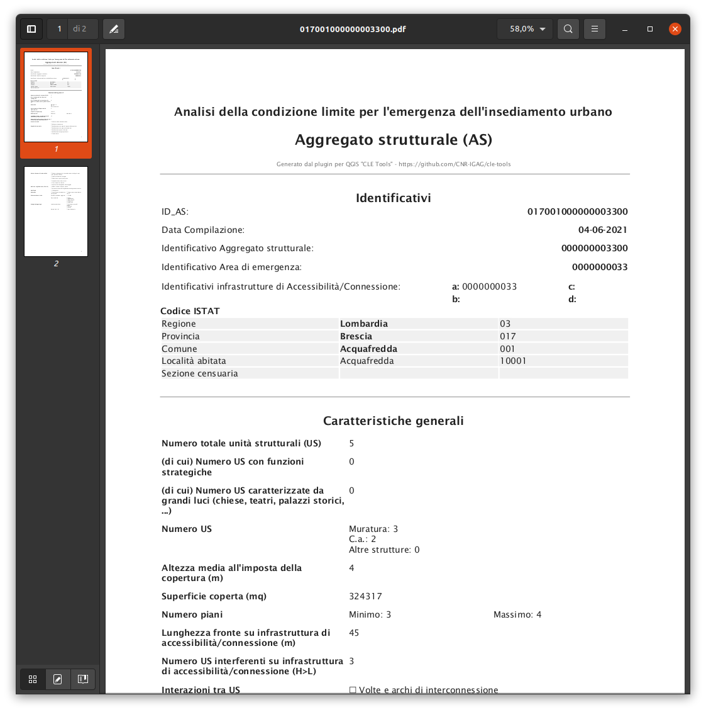

.. _report:

Generazione dei report
----------------------

.. |ico7| image:: ../../../img/ico_pdf.png
    :height: 25

Lo strumento della toolbar |ico7| permette di generare automaticamente una serie di file in formato PDF contenenti tutte le informazioni associate ad ogni dato inserito nel progetto (Infrastruttura, Area di emergenza, Aggregato strutturale, Edificio strategico o Unità strutturale).

Dopo aver scelto la cartella di destinazione ed aver cliccato sul pulsante **OK**, il plugin genera un file pdf per ogni feature contenuta nei layer di progetto CLE.

