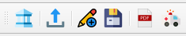

Strumenti del plugin
--------------------

Toolbar
"""""""

All'attivazione del plugin CLETools viene visualizzata nell'interfaccia di QGIS una **toolbar** contenente una serie di strumenti:

.. Note:: Se la toolbar non è presente nell'interfaccia di QGIS, è possibile riattivarla tramite il menu **Visualizza → Barre degli strumenti**.

Gli strumenti richiamabili tramite la toolbar sono:

.. |ico3| image:: ../../../img/ico_esporta.png
    :height: 25

.. |ico4| image:: ../../../img/ico_edita.png
    :height: 25

.. |ico5| image:: ../../../img/ico_salva_edita.png
    :height: 25

.. |ico7| image:: ../../../img/ico_pdf.png
    :height: 25

|ico1| **Nuovo progetto** → :ref:`nuovo-progetto`

|ico3| **Esporta dati in una struttura di progetto standard** → :ref:`esportazione`

|ico4| **Aggiungi una feature o un record** → :ref:`editing`

|ico5| **Salva** → :ref:`editing`

|ico7| **Genera report** → :ref:`report`

|ico8| **Aiuto**

Interfacce di inserimento dati
""""""""""""""""""""""""""""""

Per ogni layer di un progetto generato dal plugin, all’interno del quale è previsto l’inserimento dati, sono impostate una serie di funzionalità di QGIS che permettono al software di utilizzare **interfacce grafiche semplificate e guidate** per l’inserimento delle informazioni alfanumeriche relative alle geometrie selezionate in fase di editing.

Per maggiori informazioni vai a: :ref:`editing`

Layout di stampa
""""""""""""""""

Il plugin mette a disposizione un layout di stampa predisposto per l'output cartografico di uno studio di CLE. I layout sono accessibili tramite il menu “Progetto – Layout” di QGIS, all'interno di un progetto generato dal plugin. 

.. _layout-stampa:

Durante la creazione di un nuovo progetto, il plugin MzSTools genera una struttura di progetto specifica per il comune oggetto dello studio contenente anche il **layout di stampa** preimpostato secondo le indicazioni degli Standard MS. 

Per poter operare sul layout di stampa, è necessario:

* **attivare i layer contenuti nel group layer “Layout”**, i quali sono specificamente impostati per la restituzione cartografica;
* **disattivare gli altri gruppi di layer** utilizzati per l’inserimento e l’editing dei dati. 

I layout di stampa sono accessibili dal menu **“Progetto – Layout”**. Selezionando un layout viene aperta la finestra del compositore, in cui è possibile personalizzare manualmente alcuni elementi, quali ad esempio gli spazi testuali, ed aggiornare la legenda sulla base degli elementi effettivamente visibili su mappa.